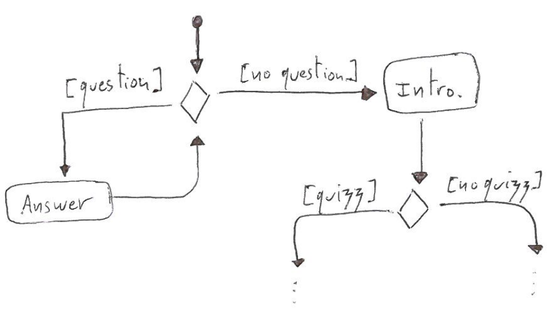

--- 
# ^^^ THIS IS THE START OF A NEW YAML DOC
documentclass: scrreprt
title: CSCI 3410 - Database Systems # ADD TITLE HERE 
subtitle: Lecture Notes (Draft) # ADD SUBTITLE HERE
author: Clément Aubert # ADD AUTHOR HERE 
institute: Augusta University # ADD INSTITUTION HERE
papersize: letter
geometry: "vmargin=2cm"
bibliography: [ bib/bib.bib, bib/entry.bib ] # ADD YOUR OWN BIB FILE HERE
link-citations: true
lang: en
numbersections: true
mainfont: Linux Libertine O
# keywords: # INSERT KEYWORDS HERE
# - Computer Science
# - Database
# - SQL
# - Database Design
# - Database Application
# - NoSQL
header-includes:
 - \usepackage{latex/packages} # ADD LATEX STYLES HERE
# pandoc-numbering:
# problem:
#    general:
#      listing-title: List of Problems 
#    standard:
#        format-link-classic: 'Pb %n'
#        format-link-title: 'Pb %n'
#    latex:
#        format-link-classic: 'Pb %n'
#        format-link-title: 'Pb %n'
---


# Image examples

## PNG example

This is an example that shows how to include a PNG image:

\

## PDF example

This is an example that shows how to include a PDF image:
(If using Dr. Aubert's figures, leave off file extension)

NOTE: Use PDF for PDF docs

\

## SVG example

This is an example that shows how to include a SVG image:
(If using Dr. Aubert's figures, leave off file extension)

NOTE: Use SVG for ODT and HTML docs

\


# Code Examples

## Entire Code File

This is an example that shows how to include an entire code file from the 
code folder:

```{include=code/sql/HelloWorld.sql}
```

## Classes

### .sqlmysql example

This is an example that shows the .sqlmysql class:

Using the exact code from above:

```{.sqlmysql include=code/sql/HelloWorld.sql}
```

### .java example

This is an example that shows the .java class:

```{.java .numberLines include=code/java/HelloWorld.java}
```

### .numberlines example

This is an example that shows how to use the .numberlines class:

```{.sqlmysql .numberLines include=code/sql/HelloWorld.sql}
```

## Attributes 

This is an example that shows how to use the startLine and endLine attributes:

```{.sqlmysql .numberLines startLine=1 endLine=1 include=code/sql/HelloWorld.sql}


This is an example that shows how to include an entire code file from the 
code folder:

```{include=code/sql/HelloWorld.sql}
```


# References

---
nocite: '@*' # TO INCLUDE ITEMS IN REFERENCES WITHOUT CITING IN BODY
...

<!-- REFERENCES AUTOMATICALLY INCLUDED AT THE END OF DOCUMENT -->


