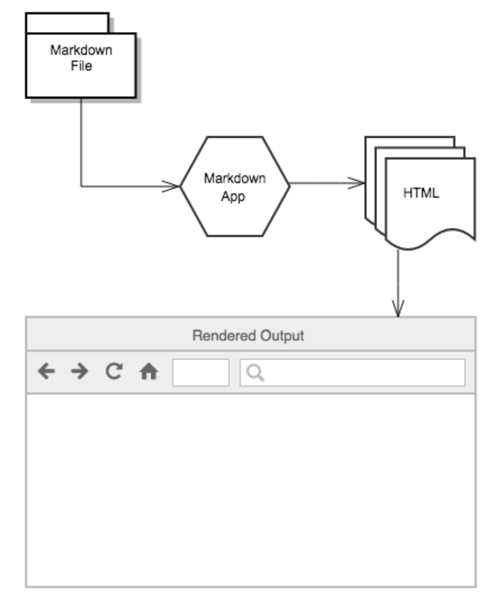
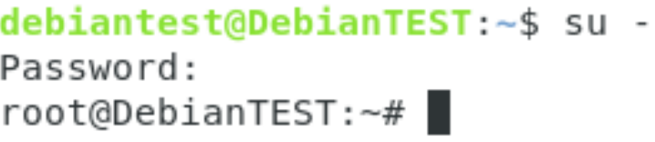

<!---
To compile this document:
Scroll down to Compiling and Converting the Document-- choose either command (HTML, ODT, PDF), change 'example' file to 'manual' and follow instructions from there.  
-->

*Overview*
*The Generating Documents (Basic) Using Markdown User Manual outlines
the objectives, requirements, and needs to be addressed when training
users on how to generate a PDF, HTML, or ODT document using markdown
file. The plan presents the activities needed to support file
development.*

# Introduction

Markdown is a fast and easy way to take notes, create content for a website, and produce print-ready documents. It's a lightweight markup language with plain text formatting syntax. Markdown is designed to be converted to many different output formats such as PDF, Word, ODT, HTML, and many more. It is both portable and platform independent, more intuitive to read and write, and can be used for websites, documents, notes, books, etc., but is often used to format readme
files and in online discussion forums.

## How Does Markdown Work? 

Markdown text is written and stored in plaintext file with a markdown extension (e.g. .md). Using a separate markdown application capable of processing markdown (we will be using Pandoc), it takes the markdown formatted text and converts it to HTML. The HTML file can then be viewable in a web browser or then converted to another file format, like PDF.

{ height=50% }


# Requirements


## Skills required 


* Markdown
	* For a basic tutorial visit: <https://commonmark.org/help/tutorial/>

Helpful Skills:

* LaTex code
* Common terminal commands
	* For more information visit: <https://www.dummies.com/computers/macs/mac-operating-systems/how-to-use-basic-unix-commands-to-work-in-terminal-on-your-mac/>
* Pandoc's Markdown
	* For more information visit: <https://pandoc.org/MANUAL.html#pandocs-markdown>
* YAML (YAML Ain't Markup Language)
	* For more information visit: <https://blog.stackpath.com/yaml/>

## Software Requirements

For a fully functioning environment and step by step guide on installation instructions follow the instructions below:

NOTE: All the following steps must be installed on a Linux operating system.

1)  Install [Git](https://github.com)
In your terminal, type (as root): `apt update`
then type: `apt install git`

NOTE: Upon opening your terminal, you may see username@hostname:~$. You want your terminal to run as root@hostname. To do this, upon opening your terminal, type: `su --`

Then enter your password. You should see something like this:

\

2) Install [Make](https://gnu.org/software/make/manual/make.html)
In your terminal, type (as root): `apt-get update`
then type: `apt-get install build-essential`

3) Install [LaTex](https://latex-project.org)
* Download
    [install-tl-unx.tar.gz](http://mirror.ctan.org/systems/texlive/tlnet/install-tl-unx.tar.gz)
    from <https://www.tug.org/texlive/acquire-netinstall.html>
* Extract the folder
* In the terminal, navigate to the location of the extracted folder
* In the terminal, type (as root): perl install-tl
* When prompted, enter command: `I`

4) Install [Python 3](https://python.org/download/releases/3.0/)
In your terminal type (as root): `apt-get install python3-pip`

5)  Install [Pandoc](https://pandoc.org)
* Download [[pandoc-2.9.1.1-1-amd64.deb]{.underline}](https://github.com/jgm/pandoc/releases/download/2.9.1.1/pandoc-2.9.1.1-1-amd64.deb) from <https://github.com/jgm/pandoc/releases/tag/2.9.1.1>
* From your terminal navigate to location of the downloaded Pandoc folder (most likely the downloads folder) and type: `dpkg -i pandoc-2.9.1.1-1-amd64.deb` 

6) Install [pandoc-include-code](https://github.com/owickstrom/pandoc-include-code) filter
* In your terminal (as normal user) type: `cabal update`
	* (cabal is a system for building and packaging Haskell libraries and programs. If cabal command not found then type (as root)):
`apt-get install haskell-platform`
	* Then, (as normal user) type: `cabal update`

NOTE: To run terminal as a normal user, type: `su - username` where "username" is your username. You should see something like this:

\

* Then type: `cabal install pandoc-types`
* Go to <https://github.com/owickstrom/pandoc-include-code> and download the repository by clicking "Download ZIP" and extract the folder
* In your terminal, navigate to the extracted folder
* In your terminal type: `cabal configure`
* Then type: `cabal install`

7) Install [pandoc-numbering](https://github.com/chdemko/pandoc-numbering) filter
Type (as normal user): `pip3 install pandoc-numbering`

8) Install [latexmk](https://mg.readthedocs.io/latexmk.html) fully automated latex document generation
* Go to <https://ctan.org/pkg/latexmk/>
* Click download link and download and extract the file.
* Open the extracted latexmk folder, locate the "latexmk.pl" file and move it to "~/.local/bin" and rename it to "latexmk".

NOTE: You may need to expose hidden files while in "Home". To do this press Ctrl + H.

9) Install [pdf2svg](https://github.com/dawbarton/pdfsvg)
In your terminal type (as root): `apt-get install pdf2svg`

10) Install [librsvg2-bin](https://github.com/teemu/librsvg2-bin)
In your terminal type (as root): `apt-get install librsvg2-bin`

11) Install [texlive-xetex](https://packages.debian.org/sid/tex/texlive-xetex)
In your terminal type (as root): `apt-get install texlive-xetex`

12) Install linuxlibertine font and freefont
* In your terminal type (as root): `apt-get install fonts-linuxlibertine`
* Then type: `apt-get install fonts-freefont-ttf`

13) Clone this [basic folder structure](https://github.com/poonamveeral/GeneralRepo) (as a normal user)
Type: `git clone https://github.com/poonamveeral/GeneralRepo`

14) Testing Pandoc
* In your terminal, navigate to Course/install
* In your terminal type: `pandoc test_pandoc.md -o test_pandoc.html`
* In the install folder, you should see a file called "test_pandoc.html"

15) Testing pandoc-numbering
* In the same install folder, type:

`pandoc test_pandoc-numbering.md --filter pandoc-numbering -o test_pandoc-numbering.html`

* If you're receiving errors, in your terminal, type: 
`export PATH=$PATH:/home/username/.local/bin`
* In the install folder, you should see a file called "test_pandoc-numbering.html"

16) Test pandoc-citeproc
* In the same install folder, type:

`pandoc --filter pandoc-citeproc test_pandoc-citeproc.md -o test_pandoc-citeproc.html`

* In the install folder, you should see a file called
    "test_pandoc-citeproc.html"

17) Test pandoc-include-code
* In the same install folder, type:
`pandoc --filter pandoc-include-code -o test_pandoc-include-code.pdf test_pandoc-include-code.md`
* In the install folder, you should see a file called "test_pandoc-citeproc.html"

If you're receiving "Could not find executable pandoc-include-code"

* Go to the root folder, and open the ".bashrc" file with a text editor
* Add the line below to the bottom of the file and click "save" to save the file:

`export PATH=$PATH:/home/username/.cabal/bin`

# Creating the Document 
Follow these steps to learn how to create a simple markdown document utilizing bibliographies, images/figures, and code blocks.

## Step 1

To start off, you're going to need a folder structure set up like this:

\


If you completed number 13 from 2.2 Software Requirements skip step 2. If not, continue on.

## Step 2

You want each folder to contain:

```{.plain}
.
├── install/                -- How to install requirements to compile the document.
│   └── .md files           -- To test Pandoc
├── bib/		    -- References (including reference to the document). 
│   └── .bib files          -- To store citations.
├── code/		    -- Source code included in the document.
│   └── code files          -- (E.g. .java, .xml, .sql)
├── fig/		    -- Source code for various figures used in the document.
├── img/	            -- Various image files itegrated in the document.
├── latex/		    -- Latex configuration file.
├── style/                  -- CSS style used for the web page.
├── Makefile                -- Directives to generate example.md document.
├── README.md               -- The present file.
└── example.md              -- Sample file to test.
```

An example of a basic template of a markdown file can be found at "example.md" in the generic repo from step 13 from above.

# Compiling and Converting the Document 
Follow these steps to learn how to compile and convert a markdown file to PDF, ODT, and HTML. Other possible conversion formats can be found here: <https://pandoc.org/>

* Open up a terminal, inside of it, change your directory to where your markdown file is located. In this example, navigate to your "Course" folder. To do this, simply type: `cd Course` where "Course" is the name of your Course folder.

* Next, type: `make fig`
"make fig" compiles all the latex code in order to produce the figures from the figures folder.

* Then type: `make fig_svg`
"make fig_svg" compiles all the latex code in order to produce the figures from the figures folder.

* To produce a PDF document common format is:

`pandoc <filters> inputfile.md -o outputfile.ext`

or

`pandoc <filters> -o outputfile.ext inputfile.md`

## PDF
For our example, in your terminal, while in the directory of where your markdown file is located, which should be your "Course" folder, type:

`make pdf`

or

```
pandoc --toc --filter pandoc-numbering --filter pandoc-citeproc --filter pandoc-include-code \
--top-level-division=chapter -M date="$(LANG=en_us_88591 date '+%B %e, %Y (%r)')" \
--pdf-engine=xelatex --pdf-engine-opt=-shell-escape -V links-as-notes \
--default-image-extension=pdf -o example.pdf example.md
```

To check if the results worked, from your desktop, navigate to your "Course" folder. You should see a new file called "example.pdf".

## ODT
For our example, in your terminal, while in the directory of where your markdown file is located, which should be your "Course" folder, type:

`make odt`

or

```
pandoc  --toc --filter pandoc-numbering --filter pandoc-citeproc --filter pandoc-include-code \
--top-level-division=chapter -M date="$(LANG=en_us_88591 date '+%B %e, %Y (%r)')" \
--default-image-extension=svg -o example.odt example.md
```

To check if the results worked, from your desktop, navigate to your "Course" folder. You should see a new file called "example.odt".


## HTML
For our example, in your terminal, while in the directory of where your markdown file is located, which should be your "Course" folder, type: 

`make html`

or

```
pandoc --toc --filter pandoc-numbering --filter pandoc-citeproc --filter pandoc-include-code \
--top-level-division=chapter -M date="$(LANG=en_us_88591 date '+%B %e, %Y (%r)')" \
--css=style/style.css --toc-depth=1 --self-contained --default-image-extension=svg \
-o example.html example.md
```

where "style.css" is the name of your css file.

To check if the results worked, from your desktop, navigate to your "Course" folder. You should see a new file called "example.html".


